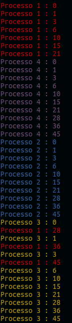
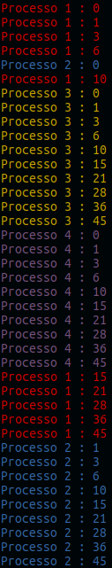
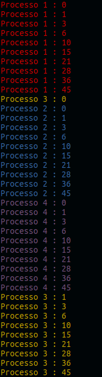
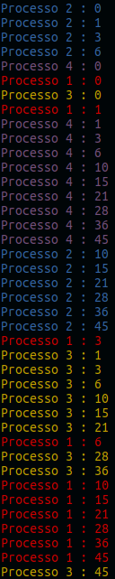
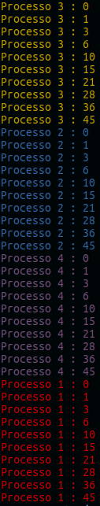
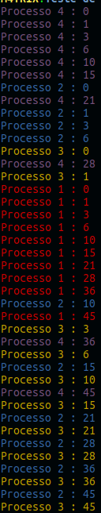
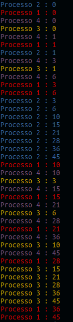

# Conceitos Básicos de Programação Concorrente

### Definição

* Na programação concorrente se consiste em um conjunto de **Processos Sequênciais**, que são Processo que possuem uma sequência de comandos finitos.
* Um Processo é uma ação que o programa deve fazer, onde pode ser qualquer coisa que necessita a utilização do programa.
* Cada Processo possui um número de comandos **Atômicos**, ou seja, comandos que 
* Cada Processo possui um **Control Pointer**, que vai indica o próximo comando que pode ser executado pelo Processo.
* Uma **Computação** descreve uma execução possível do programa concorrente, porque cada vez que for rodado um programa concorrente ele vai processar de forma diferente.
* Uma **Computação** é obtida por um entrelaçamento, conhecido como **interleaving arbitrário** dos comandos atômicos dos processos do programa.
* Um conjunto de todas as Computações do Programa se chama **Comportamento**
* **Semântica de Interleaving** é uma forma de representar a execução de um sistema concorrente. É a mais utilizada na * 
* literatura. Há outras semânticas para representar concorrência como:
  * true concurrency
  * semântica de eventos
  * traces de Marzukievicz


### Visualização

* Este é um programa simples de Thread, chamando a Classe Thread de Java

```java
public class FuncoesThread extends Thread{
    
    // Variáveis
    private int max = 10;
    private int id;
    private String color;

    // Cores
    private final String reset = "\033[0m";

    // Construtor
    public FuncoesThread(int id, String color){
        this.id = id;
        this.color = color;

    }

    // Chamando a Função de run da Classe Thread
    public void run(){
        int value = 0;
        for(int i = 0 ; i < max ; i++){
            value += i;
            System.out.println(color + "Processo " + id + " : " + value + reset);
        }
    }
}
```
* Agora iremos fazer com que 4 **Processos** sejam inicializados, utilizamos a Função `start()` da Classe Thread para iniciar um Processo, como no arquivo de Teste abaixo

```java
public class TestFunctions {

    // Cores
    public static String red = "\033[0;31m";
    public static final String blue = "\033[0;34m";
    public static final String yellow = "\033[0;33m";
    public static final String purple = "\033[0;35m";

    public static void main(String[] args) {

        // Criação de Processos
        FuncoesThread p1 = new FuncoesThread(1, red);
        FuncoesThread p2 = new FuncoesThread(2, blue);
        FuncoesThread p3 = new FuncoesThread(3, yellow);
        FuncoesThread p4 = new FuncoesThread(4, purple);

        // Inicialização dos Processos
        // -> usamos a Função start() e a função procura o run()
        p1.start();
        p2.start();
        p3.start();
        p4.start();

        
    }    
}
```

* O Programa vai ativar o p1,p2,p3 e p4 de forma aleatória, sendo isso chamado de **Interleaving Arbitrário (entrelaçamento)**, onde nesse caso
os comandos atômicos se encontram no **Run()** da Classe _FuncoesThread_.
* Após concluirem todos os Processos criados, essa solução é chamado de **Computação**, que é uma execução possivel das várias execuções possíveis do programa.
* O conjunto de Computações é chamado de **Comportamento**, que mostra o comporamento que o programa é resolvido, podendo quase ser infinito o nro de comportamentos

* Abaixo algumas **Computações** desse Programa:

  

   



