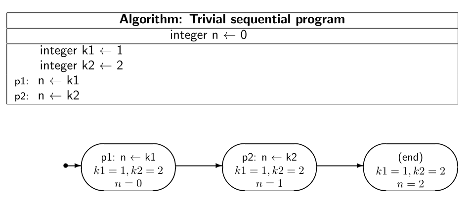
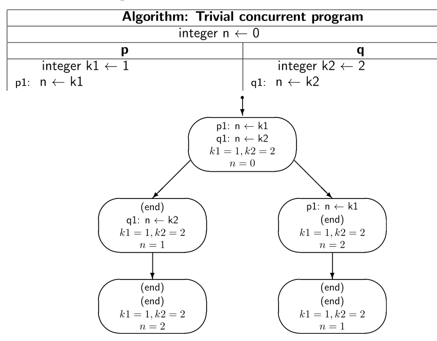

# Programa Sequêncial vc Programa Concorrente

## Programa Sequêncial

* Em um Programa Sequêncial, cada etapa é feita primeiro, onde somente depois que um Processo terminou
ele inicia o próximo processo, como no exemplo abaixo:



No exemplo acima, irei colocar de forma programático:

```java
int n = 0 
int k1 = 1;
int k2 = 2;

função
public int process(int k){
    n = k;
    return n
}

process(k1); //P1, vai ser feito primeiro
process(k2); //P2, vai ser feito depois

// Saida: k1 = 1 , k2 = 2 , n = 2

```

* Como podemos ver, em um programa sequêncial se vai ser feito cada processo (no caso **process(k)**) por vez
dessa forma ele somente vai para outro Processo quando tiver terminado o Processo anterior.

## Programa Concorrente

* Em um Programa Concorrente, ele vai ativando os Processos de forma aleatória, podendo um processo terminar
antes de outro, como podemos ver no exemplo abaixo:



Agora apresentando de forma Programática

```java
public class FuncoesThread extends Thread{
    
    private int max = 10;
    private int id;
    private String color;

    private final String reset = "\033[0m";

    public FuncoesThread(int id, String color){
        this.id = id;
        this.color = color;

    }

    public void run(){
        int value = 0;
        for(int i = 0 ; i < max ; i++){
            value += i;
            System.out.println(color + "Processo " + id + " : " + value + reset);
        }
    }
}
```
```java
public class TestFunctions {

    // Cores
    public static String red = "\033[0;31m";
    public static final String blue = "\033[0;34m";

    public static void main(String[] args) {

        // Processos
        FuncoesThread p1 = new FuncoesThread(1, red);
        FuncoesThread p2 = new FuncoesThread(2, blue);

        p1.start();
        p2.start();

        
    }    
}
```

* Nesse exemplo simples de um Programa Concorrente, tem dois Processos iniciados
* Esses Processos são definidos por uma Thread, que irá selecionar de forma aleatória qual processo 
vai ser iniciado, por isso que a árvore de processo da imagem é tão grande, porque são todas as formas
que o programa pode acontecer.